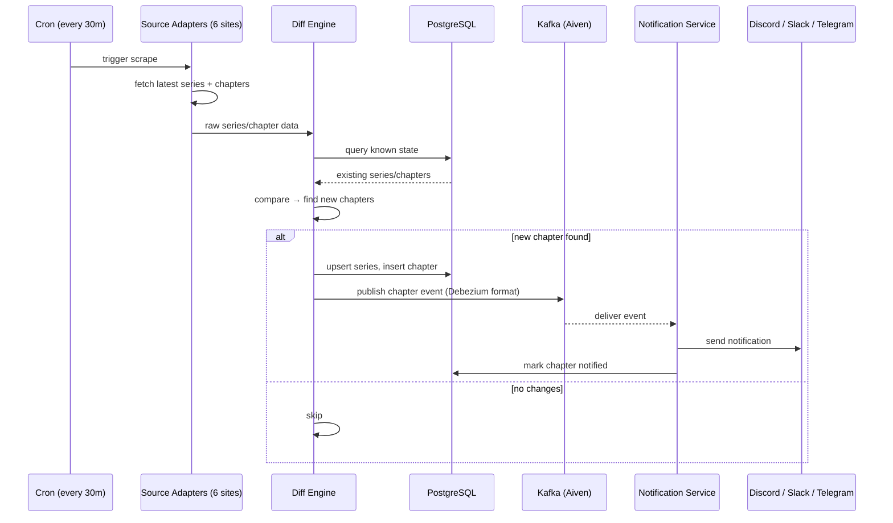
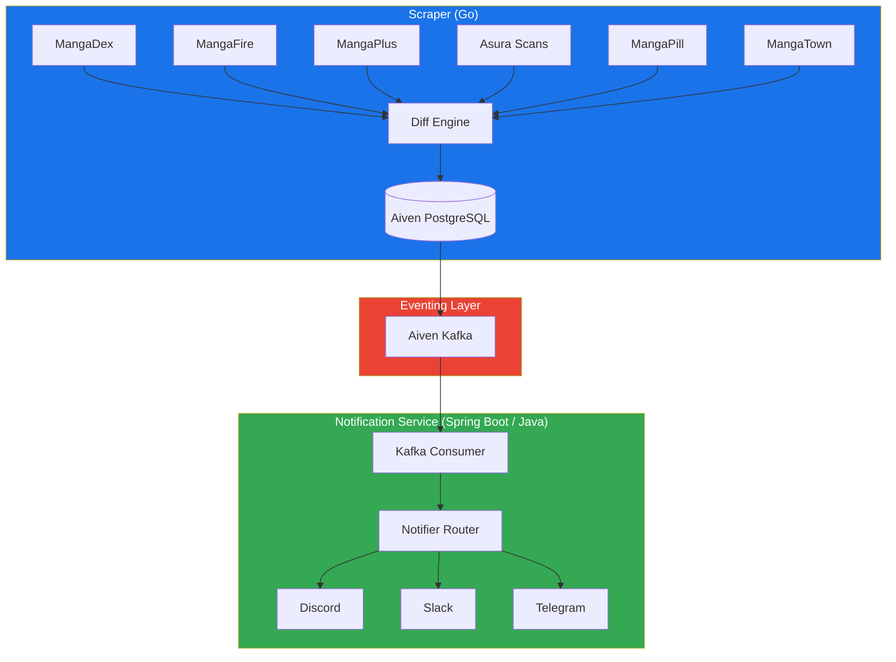

# manga-cdc

Track manga releases from multiple scan sites and get notified when new chapters drop — via Discord, Slack, or Telegram.

## The Problem

Manga chapters are scattered across half a dozen scanlation sites (MangaDex, MangaFire, MangaPlus, Asura Scans, MangaPill, MangaTown). Each site has different update schedules, different APIs (or no API at all), and no unified way to track what's new. Manually checking each site daily is tedious and error-prone.

Manga-CDC solves this by acting as a **Change Data Capture pipeline for manga releases**: it scrapes all sources on a cron schedule, detects new chapters via a diff engine, and pushes notifications through your preferred channels — all in real-time via Kafka streaming.

## How It Works



## Architecture



**Production deployment** uses [Aiven](https://aiven.io) for managed PostgreSQL and Kafka (SCRAM-SHA-256 over SASL_SSL).

For local development, the [setup wizard](#quick-start) provisions Postgres and Redpanda in Docker Compose. The scraper publishes Debezium-compatible JSON directly to Redpanda (no Debezium connector).

For production, choose your own managed PostgreSQL and either Kafka or QStash via the wizard — deploy with Docker Compose or Helm.

## Why This Stack

| Question | Answer |
|----------|--------|
| **Why Go for the scraper?** | Fast startup, low memory, excellent concurrency for parallel scraping, single binary deploy |
| **Why Spring Boot / Java for notifications?** | Rich ecosystem for notification integrations, JDBC/R2DBC, battle-tested Kafka client |
| **Why Kafka?** | Reliable at-least-once delivery, persistent event log, consumer group rebalancing, Debezium-compatible schema |
| **Why Aiven?** | Managed Kafka + Postgres under one provider, SCRAM-SHA-256 auth, no operational overhead |
| **Why both Kafka and QStash paths?** | Kafka for production-grade streaming; QStash as a production HTTP alternative without running a broker |

## Tech Stack

| Component | Technology |
|-----------|-----------|
| Scraper | Go 1.26, pgx, Colly, segmentio/kafka-go |
| Database | Aiven PostgreSQL 16 |
| Eventing | Aiven Kafka (SASL_SSL / SCRAM-SHA-256) |
| Notifications | Spring Boot 3.3, Java 21 |
| Notifier targets | Discord, Slack, Telegram |
| Metrics | Prometheus + Grafana (local); Grafana Cloud + Alloy (prod) |
| Deployment | Docker Compose, Kubernetes/Helm, Terraform (GCP, AWS, Azure, DigitalOcean) |
| Orchestration | GitHub Actions CI/CD |

## Quick Start

```bash
# Clone the repo
git clone https://github.com/aeswibon/manga-cdc.git
cd manga-cdc

# Run the setup wizard (local or production tier)
go run ./configure

# Re-generate artifacts from a saved manifest
cp manga-cdc.config.example.yaml manga-cdc.config.yaml
go run ./configure generate

# Follow the generated guide
cat SETUP.md
```

## Project Structure

```
manga-cdc/
├── configure/                  # Setup wizard (Go CLI, manifest + generators)
│   ├── manifest/               # manga-cdc.config.yaml schema + validation
│   └── presets/                # Provider hint presets (Aiven, Neon, Upstash, etc.)
├── scraper/                    # Go scraper module
│   ├── cmd/scraper/            # Scraper entrypoint
│   ├── internal/
│   │   ├── adapter/            # Source adapters (6 sources)
│   │   ├── model/              # Domain types
│   │   ├── db/                 # PostgreSQL client (pgx)
│   │   ├── migrate/            # goose SQL migrations on startup
│   │   ├── diff/               # Change detection engine
│   │   ├── kafka/              # Kafka producer (optional)
│   │   ├── qstash/             # QStash publisher (optional)
│   │   └── config/             # Env-based config
├── notification-service/       # Spring Boot notification service
│   └── src/main/java/com/mangacdc/
│       ├── controller/         # Webhook endpoint for QStash
│       ├── service/            # Kafka consumer + notifiers
│       └── repository/         # JDBC data access
├── db/migrations/              # SQL schema migrations (applied by scraper via goose)
├── helm/                       # Kubernetes Helm chart
├── terraform/                  # Multi-Cloud Terraform IaC + bootstrap/
│   └── bootstrap/              # One-time CI/CD prerequisites per cloud
├── docker-compose.yml          # Local dev compose (generated)
├── docker-compose.prod.yml     # Production compose (generated)
├── docker-compose.observability.yml        # Local self-hosted Prometheus + Grafana
├── docker-compose.observability-cloud.yml  # Prod Alloy → Grafana Cloud remote_write
├── alloy/config.prod.alloy     # Alloy scrape + remote_write config
├── grafana/dashboards/         # manga-cdc dashboard JSON
└── prometheus.yml              # Local metrics scraping config
```

## Development

### Without the wizard

```bash
# Start PostgreSQL
docker compose up -d postgres

# Run scraper (Go) — applies db/migrations on startup; exposes :2112/metrics, /healthz, /readyz
cd scraper && go run ./cmd/scraper

# Run notification service (Java)
cd notification-service && ./mvnw spring-boot:run
```

### Environment Variables

See `.env.example` (generated by the setup wizard) for all available options.

### Adding a New Source

Implement the `SourceAdapter` interface in `scraper/internal/adapter/`:

```go
type SourceAdapter interface {
    Name() string
    FetchLatest(ctx context.Context) ([]model.Series, error)
    FetchChapters(ctx context.Context, seriesID string) ([]model.Chapter, error)
}
```

## Dashboards & Metrics

### Local

| Service | URL |
|---------|-----|
| Kafka UI | http://localhost:8085 |
| Prometheus | http://localhost:9090 |
| Grafana | http://localhost:3000/d/manga-cdc-overview/manga-cdc |
| Notification logs API | http://localhost:8080/api/logs?limit=50 |
| Scraper health | http://localhost:2112/healthz, `/readyz`, `/metrics` |

Local Compose auto-provisions the **manga-cdc** dashboard from `grafana/dashboards/manga-cdc.json`.

### Production (Grafana Cloud)

Prod does **not** run Prometheus or Grafana on the VM. **Grafana Alloy** scrapes app metrics and `remote_write`s to your Grafana Cloud stack.

- Dashboard: `https://<stack>.grafana.net/d/manga-cdc-overview/manga-cdc`
- Import `grafana/dashboards/manga-cdc.json` in the Grafana Cloud UI once (set the Prometheus datasource UID to your stack’s default Prometheus datasource)

## Production Deployments (Multi-Cloud)

Manga-CDC supports production deployments across multiple major cloud providers (**GCP**, **AWS**, **Azure**, and **DigitalOcean**) using **VM (Docker Compose)**, **Kubernetes (Helm)**, or **Serverless (Containers + Cron)** targets.

For complete architectural details, variables settings, local CLI workflow, and GitHub Actions CI/CD setup, refer to the **[Multi-Cloud Production Setup Guide](file:///Volumes/Seagate/developer/personal/manga-cdc/docs/cloud-setup.md)**.

### Release Flow

* Pushes to `master` run tests and checks only.
* Pushing a version tag (`v*`) runs tests, builds CI container snapshots, executes end-to-end tests, creates a GitHub release, and triggers the deployment pipeline.

### Observability

Tag deploys start Alloy via `docker-compose.observability-cloud.yml` (`OBSERVABILITY_MODE=grafana-cloud` by default). Set `OBSERVABILITY_MODE=self-hosted` to use VM-hosted Prometheus + Grafana instead (`docker-compose.observability.yml`).

### Grafana Cloud (Alloy `remote_write`) Secrets

If you are using Grafana Cloud for monitoring, set up these secrets in your GitHub repository:
- `GRAFANA_CLOUD_PROMETHEUS_URL` — push URL (Cloud Portal → Prometheus → Details)
- `GRAFANA_CLOUD_PROMETHEUS_USER` — metrics instance ID
- `GRAFANA_CLOUD_API_KEY` — Access policy token with **`metrics:write`** scope
- `GRAFANA_CLOUD_STACK_URL` — e.g. `https://yourstack.grafana.net`
- `GRAFANA_CLOUD_PROMETHEUS_DATASOURCE_UID` — optional stack Prometheus datasource UID

## Local Development

The [setup wizard](#quick-start) local tier provisions Postgres, Redpanda, scraper, notification service, Prometheus, and Grafana in Docker Compose. QStash is available as a production bring-your-own option only.

## License

MIT
