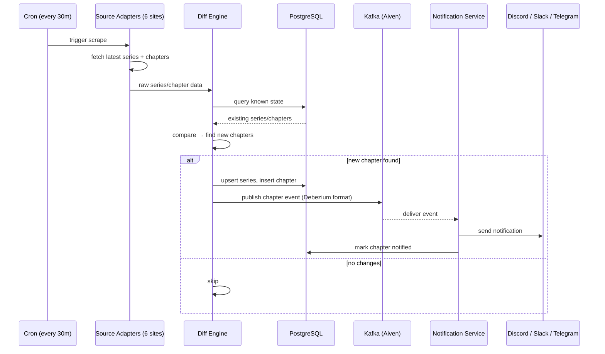
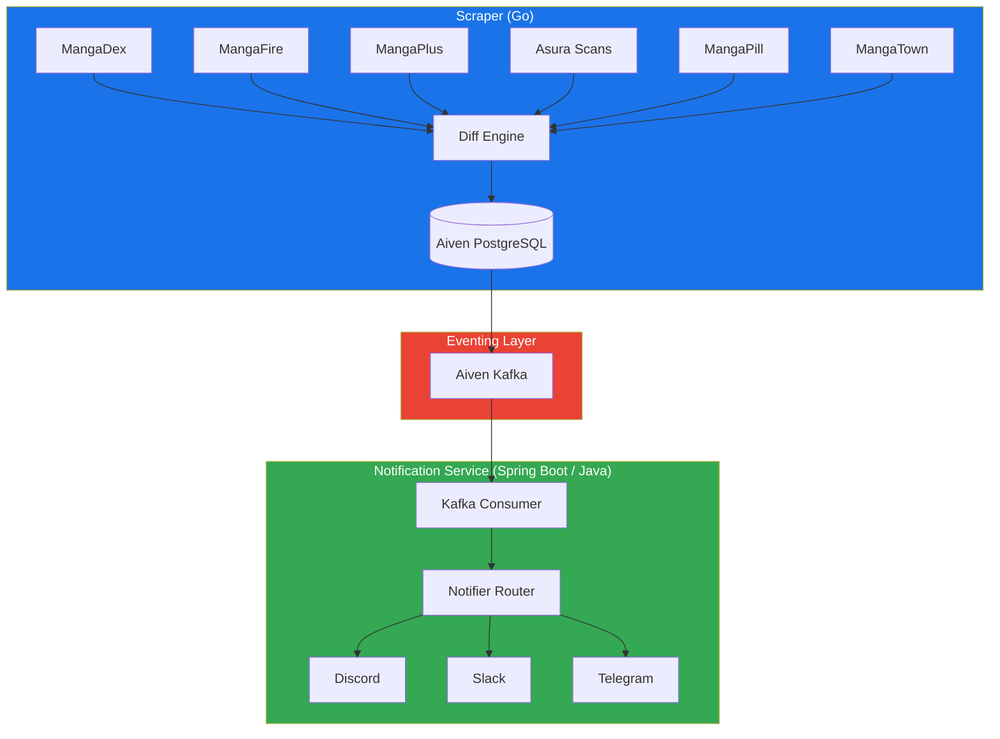

# manga-cdc

Track manga releases from multiple scan sites and get notified when new chapters drop — via Discord, Slack, or Telegram.

## The Problem

Manga chapters are scattered across half a dozen scanlation sites (MangaDex, MangaFire, MangaPlus, Asura Scans, MangaPill, MangaTown). Each site has different update schedules, different APIs (or no API at all), and no unified way to track what's new. Manually checking each site daily is tedious and error-prone.

Manga-CDC solves this by acting as a **Change Data Capture pipeline for manga releases**: it scrapes all sources on a cron schedule, detects new chapters via a diff engine, and pushes notifications through your preferred channels — all in real-time via Kafka streaming.

## How It Works



## Architecture



**Production deployment** uses [Aiven](https://aiven.io) for managed PostgreSQL and Kafka (SCRAM-SHA-256 over SASL_SSL).

For local development, the [setup wizard](#quick-start) provisions Postgres and Redpanda in Docker Compose. The scraper publishes Debezium-compatible JSON directly to Redpanda (no Debezium connector).

For production, choose your own managed PostgreSQL and either Kafka or QStash via the wizard — deploy with Docker Compose or Helm.

## Why This Stack

| Question | Answer |
|----------|--------|
| **Why Go for the scraper?** | Fast startup, low memory, excellent concurrency for parallel scraping, single binary deploy |
| **Why Spring Boot / Java for notifications?** | Rich ecosystem for notification integrations, JDBC/R2DBC, battle-tested Kafka client |
| **Why Kafka?** | Reliable at-least-once delivery, persistent event log, consumer group rebalancing, Debezium-compatible schema |
| **Why Aiven?** | Managed Kafka + Postgres under one provider, SCRAM-SHA-256 auth, no operational overhead |
| **Why both Kafka and QStash paths?** | Kafka for production-grade streaming; QStash as a production HTTP alternative without running a broker |

## Tech Stack

| Component | Technology |
|-----------|-----------|
| Scraper | Go 1.26, pgx, Colly, segmentio/kafka-go |
| Database | Aiven PostgreSQL 16 |
| Eventing | Aiven Kafka (SASL_SSL / SCRAM-SHA-256) |
| Notifications | Spring Boot 3.3, Java 21 |
| Notifier targets | Discord, Slack, Telegram |
| Metrics | Prometheus + Grafana |
| Deployment | Docker Compose, Kubernetes/Helm, Terraform/GCP |
| Orchestration | GitHub Actions CI/CD |

## Quick Start

```bash
# Clone the repo
git clone https://github.com/aeswibon/manga-cdc.git
cd manga-cdc

# Run the setup wizard (local or production tier)
go run ./configure

# Re-generate artifacts from a saved manifest
cp manga-cdc.config.example.yaml manga-cdc.config.yaml
go run ./configure generate

# Follow the generated guide
cat SETUP.md
```

## Project Structure

```
manga-cdc/
├── configure/                  # Setup wizard (Go CLI, manifest + generators)
│   ├── manifest/               # manga-cdc.config.yaml schema + validation
│   └── presets/                # Provider hint presets (Aiven, Neon, Upstash, etc.)
├── scraper/                    # Go scraper module
│   ├── cmd/scraper/            # Scraper entrypoint
│   ├── internal/
│   │   ├── adapter/            # Source adapters (6 sources)
│   │   ├── model/              # Domain types
│   │   ├── db/                 # PostgreSQL client (pgx)
│   │   ├── diff/               # Change detection engine
│   │   ├── kafka/              # Kafka producer (optional)
│   │   ├── qstash/             # QStash publisher (optional)
│   │   └── config/             # Env-based config
├── notification-service/       # Spring Boot notification service
│   └── src/main/java/com/mangacdc/
│       ├── controller/         # Webhook endpoint for QStash
│       ├── service/            # Kafka consumer + notifiers
│       └── repository/         # JDBC data access
├── connectors/                 # Debezium connector configs
├── db/migrations/              # SQL schema migrations
├── helm/                       # Kubernetes Helm chart
├── terraform/                  # GCP Terraform IaC
├── docker-compose.yml          # Local dev compose (generated)
├── docker-compose.prod.yml     # Production compose (generated)
└── prometheus.yml              # Metrics scraping config
```

## Development

### Without the wizard

```bash
# Start PostgreSQL
docker compose up -d postgres

# Run scraper (Go)
cd scraper && go run ./cmd/scraper

# Run notification service (Java)
cd notification-service && ./mvnw spring-boot:run
```

### Environment Variables

See `.env.example` (generated by the setup wizard) for all available options.

### Adding a New Source

Implement the `SourceAdapter` interface in `scraper/internal/adapter/`:

```go
type SourceAdapter interface {
    Name() string
    FetchLatest(ctx context.Context) ([]model.Series, error)
    FetchChapters(ctx context.Context, seriesID string) ([]model.Chapter, error)
}
```

## Dashboard Access

| Service | URL |
|---------|-----|
| Kafka UI | http://localhost:8085 |
| Prometheus | http://localhost:9090 |
| Grafana | http://localhost:3000 |

## Production (Aiven)

The production deployment uses [Aiven](https://aiven.io) for both PostgreSQL and Kafka:

- **Aiven PostgreSQL** — scraper connects via `DATABASE_URL` (postgres:// with SSL); notification service connects via derived JDBC URL
- **Aiven Kafka** — scraper publishes chapter events using SCRAM-SHA-256 over SASL_SSL; notification service consumes from the same topic

**Required secrets** in GitHub Actions:

GCP deploy:
- `GCP_WORKLOAD_IDENTITY_PROVIDER` — Workload Identity Federation provider resource name
- `GCP_SERVICE_ACCOUNT` — deploy service account email (e.g. `github-actions-cd@….iam.gserviceaccount.com`)
- `GCP_VM_NAME`, `GCP_ZONE`, `GCP_SSH_USER`, `GCP_SSH_PRIVATE_KEY`

Data & notifications:
- `DATABASE_URL`, `KAFKA_BROKERS`, `KAFKA_USERNAME`, `KAFKA_PASSWORD`
- Discord/Slack/Telegram webhook tokens

## Local Development

The [setup wizard](#quick-start) local tier provisions Postgres, Redpanda, scraper, notification service, Prometheus, and Grafana in Docker Compose. QStash is available as a production bring-your-own option only.

## License

MIT
