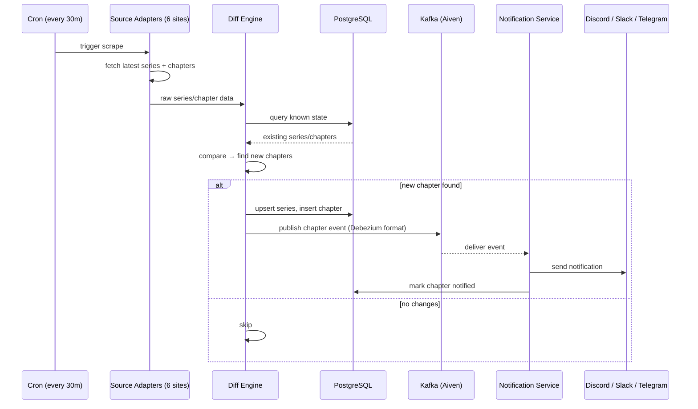
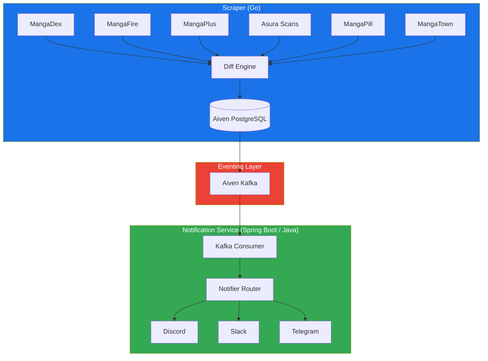
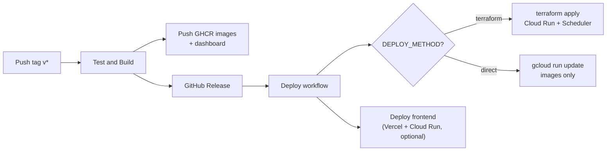

# manga-cdc

Track manga releases from multiple scan sites and get notified when new chapters drop — via Discord, Slack, or Telegram.

## The Problem

Manga chapters are scattered across half a dozen scanlation sites (MangaDex, MangaFire, MangaPlus, Asura Scans, MangaPill, MangaTown). Each site has different update schedules, different APIs (or no API at all), and no unified way to track what's new. Manually checking each site daily is tedious and error-prone.

Manga-CDC solves this by acting as a **Change Data Capture pipeline for manga releases**: it scrapes all sources on a cron schedule, detects new chapters via a diff engine, and pushes notifications through your preferred channels — all in real-time via Kafka streaming.

## How It Works



## Architecture



**Production** uses managed PostgreSQL and Kafka (e.g. [Aiven](https://aiven.io)) plus cloud-hosted containers. The scraper publishes Debezium-compatible JSON directly to Kafka.

For local development, the [setup wizard](#quick-start) provisions Postgres and Redpanda in Docker Compose.

## Why This Stack

| Question | Answer |
|----------|--------|
| **Why Go for the scraper?** | Fast startup, low memory, excellent concurrency for parallel scraping, single binary deploy |
| **Why Spring Boot / Java for notifications?** | Rich ecosystem for notification integrations, JDBC/R2DBC, battle-tested Kafka client |
| **Why Kafka?** | Reliable at-least-once delivery, persistent event log, consumer group rebalancing, Debezium-compatible schema |
| **Why Aiven?** | Managed Kafka + Postgres under one provider, SCRAM-SHA-256 auth, no operational overhead |

## Tech Stack

| Component | Technology |
|-----------|-----------|
| Scraper | Go 1.26, pgx, Colly, segmentio/kafka-go |
| Database | Aiven PostgreSQL 16 |
| Eventing | Aiven Kafka (SASL_SSL / SCRAM-SHA-256) |
| Notifications | Spring Boot 3.3, Java 21 |
| Notifier targets | Discord, Slack, Telegram |
| Metrics | Prometheus + Grafana (local); Grafana Cloud + Alloy (prod) |
| Deployment | Docker Compose (local), Terraform (GCP/AWS/Azure/DO), Helm (Kubernetes), GitHub Actions CI/CD |
| Orchestration | GitHub Actions CI/CD |

## Quick Start

```bash
# Clone the repo
git clone https://github.com/aeswibon/manga-cdc.git
cd manga-cdc

# Run the setup wizard (local or production tier)
go run ./configure

# Re-generate artifacts from a saved manifest
cp config/manga-cdc.example.yaml config/manga-cdc.yaml
go run ./configure generate

# Follow the generated local guide
cat SETUP.md
```

## Project Structure

```
manga-cdc/
├── configure/                  # Setup wizard (Go CLI, manifest + generators)
│   ├── manifest/               # config/manga-cdc.yaml schema + validation
│   └── presets/                # Provider hint presets (Aiven, Neon, Upstash, etc.)
├── config/                     # Setup manifest + Prometheus scrape config
│   ├── manga-cdc.example.yaml  # Example manifest (copy to manga-cdc.yaml)
│   └── prometheus.yml          # Metrics scraping config (local + VM observability)
├── scraper/                    # Go scraper module
│   ├── cmd/scraper/            # Scraper entrypoint
│   ├── internal/
│   │   ├── adapter/            # Source adapters (6 sources)
│   │   ├── model/              # Domain types
│   │   ├── db/                 # PostgreSQL client (pgx)
│   │   ├── migrate/            # goose SQL migrations on startup
│   │   ├── diff/               # Change detection engine
│   │   ├── kafka/              # Kafka producer (optional)
│   │   ├── qstash/             # QStash publisher (optional)
│   │   └── config/             # Env-based config
├── notification-service/       # Spring Boot notification service
│   └── src/main/java/com/mangacdc/
│       ├── controller/         # Webhook endpoint for QStash
│       ├── service/            # Kafka consumer + notifiers
│       └── repository/         # JDBC data access
├── dashboard/                  # Svelte operator dashboard (read-only watchlist UI)
├── status-page/                # Public status page (Vercel + local Node server)
├── data/watchlist.yaml         # Community-curated tracked series list
├── scripts/validate-watchlist.py
├── helm/                       # Kubernetes Helm chart
├── terraform/                  # Multi-Cloud Terraform IaC + bootstrap/
│   └── bootstrap/              # One-time CI/CD prerequisites per cloud
├── docker-compose.yml          # Local dev compose (generated)
├── docker-compose.prod.yml     # Production compose (generated)
├── docker-compose.observability.yml        # Local self-hosted Prometheus + Grafana
├── docker-compose.observability-cloud.yml  # Prod Alloy → Grafana Cloud remote_write
├── alloy/config.prod.alloy     # Alloy scrape + remote_write config
├── grafana/dashboards/         # manga-cdc dashboard JSON
```

## Development

### Local (Docker Compose)

```bash
docker compose up -d --build
```

| Service | URL |
|---------|-----|
| Dashboard | http://localhost |
| Status page | http://localhost:3001 |
| Notification API | http://localhost:8080/api/logs?limit=50 |
| Pipeline health | http://localhost:8080/api/pipeline/health |
| Scraper health | http://localhost:2112/healthz, `/readyz`, `/metrics` |
| Prometheus | http://localhost:9090 |
| Grafana | http://localhost:3000/d/manga-cdc-overview/manga-cdc |

The dashboard links to the status page via `VITE_STATUS_PAGE_URL` (defaults to `http://localhost:3001` in Compose). Edit [`data/watchlist.yaml`](data/watchlist.yaml) locally or follow [CONTRIBUTING.md](CONTRIBUTING.md) to propose watchlist changes via PR.

### Local (manual processes)

```bash
# Start PostgreSQL
docker compose up -d postgres

# Run scraper (Go) — applies db/migrations on startup; exposes :2112/metrics, /healthz, /readyz
cd scraper && go run ./cmd/scraper

# Run notification service (Java)
cd notification-service && ./mvnw spring-boot:run
```

### Environment Variables

See `.env.example` (generated by the setup wizard) for all available options.

### Adding a New Source

Implement the `SourceAdapter` interface in `scraper/internal/adapter/`:

```go
type SourceAdapter interface {
    Name() string
    FetchLatest(ctx context.Context) ([]model.Series, error)
    FetchChapters(ctx context.Context, seriesID string) ([]model.Chapter, error)
}
```

## Dashboards & Metrics

Local URLs are listed under [Development → Local (Docker Compose)](#local-docker-compose). Local Compose auto-provisions the **manga-cdc** dashboard from `grafana/dashboards/manga-cdc.json`.

### Production (Grafana Cloud)

On **GCP serverless**, metrics are exposed on each Cloud Run service (`/metrics`, `/actuator/prometheus`). If Grafana Cloud secrets are set, they are injected as environment variables at deploy time — import the dashboard once in Grafana Cloud:

- Dashboard JSON: `grafana/dashboards/manga-cdc.json`
- URL pattern: `https://<stack>.grafana.net/d/manga-cdc-overview/manga-cdc`

On **VM** deployments, Grafana Alloy can `remote_write` to Grafana Cloud via `docker-compose.observability-cloud.yml`.

## Production Setup

Production runs the **scraper** and **notification service** as containers against your managed Postgres + Kafka, deployed via **Terraform** and **GitHub Actions**. The recommended path is **GCP serverless** (Cloud Run + Cloud Scheduler) — no VMs to maintain.

For VM, Kubernetes, or other clouds, see [docs/cloud-setup.md](docs/cloud-setup.md) and [terraform/README.md](terraform/README.md).

### Prerequisites

Before bootstrapping, provision these **outside** the repo (keep credentials handy):

| Service | Purpose |
|---------|---------|
| **PostgreSQL** | Series/chapter state (e.g. Aiven Postgres 16) |
| **Kafka** | Chapter events, SASL_SSL + SCRAM-SHA-256 (e.g. Aiven Kafka) |
| **Discord / Slack / Telegram** | At least one notification channel |
| **Grafana Cloud** (optional) | Metrics via env vars injected into Cloud Run |
| **GitHub repo** | Fork or use `aeswibon/manga-cdc` with Actions enabled |

### Step 1 — One-time cloud bootstrap

Bootstrap creates the Terraform **remote state bucket**, enables required **GCP APIs**, and wires **GitHub Actions → GCP** via Workload Identity Federation. It also pushes CI secrets when `gh` is logged in.

```bash
# Authenticate
gcloud auth login
gcloud auth application-default login
gcloud config set project YOUR_PROJECT_ID

# Optional: app secrets for gh secret sync (otherwise set in GitHub UI)
cp .env.example .env   # edit DATABASE_URL, KAFKA_*, webhooks, Grafana Cloud

# Bootstrap GCP serverless
chmod +x scripts/bootstrap.sh
./scripts/bootstrap.sh --cloud gcp --target serverless
```

Other clouds use the same script: `--cloud aws|azure|digitalocean` (see [terraform/README.md](terraform/README.md)).

Use `--skip-gh-secrets` if you prefer setting secrets manually in GitHub. Use `--dry-run` to preview the Terraform plan.

### Step 2 — GitHub repository secrets

If bootstrap ran with `gh auth login`, routing and cloud auth secrets are set automatically. Otherwise configure these in **Settings → Secrets and variables → Actions**:

**Routing (required)**

| Secret | Example / notes |
|--------|-----------------|
| `DEPLOY_CLOUD` | `gcp` |
| `DEPLOY_TARGET` | `serverless` |
| `DEPLOY_METHOD` | `terraform` for first deploy; `direct` afterward |

**GCP auth + state (required for GCP)**

| Secret | Description |
|--------|-------------|
| `GCP_PROJECT_ID` | Your GCP project ID |
| `GCP_REGION` | e.g. `us-central1` |
| `TF_STATE_BUCKET` | GCS bucket from bootstrap |
| `GCP_WORKLOAD_IDENTITY_PROVIDER` | Full WIF provider resource name |
| `GCP_SERVICE_ACCOUNT` | Deploy service account email |

**Application (required)**

| Secret | Description |
|--------|-------------|
| `DATABASE_URL` | `postgres://...` connection string |
| `KAFKA_BROKERS` | Comma-separated broker list |
| `KAFKA_USERNAME` | Kafka SASL username |
| `KAFKA_PASSWORD` | Kafka SASL password |
| `DISCORD_WEBHOOK_URL` | Or Slack/Telegram secrets |
| `API_READ_KEY` | Shared read key for notifier `/api/*` and metrics (see [docs/security-model.md](docs/security-model.md)) |
| `WEBHOOK_SECRET` | Fallback shared secret for `POST /api/webhook` |
| `QSTASH_CURRENT_SIGNING_KEY` | Upstash QStash signing key (current) |
| `QSTASH_NEXT_SIGNING_KEY` | Upstash QStash signing key (rotation) |

**Security (repository variable)**

| Variable | Description |
|----------|-------------|
| `ALLOWED_ORIGINS` | Comma-separated browser origins (e.g. `https://your-dashboard.vercel.app,https://your-status.vercel.app`) |

See [docs/security-model.md](docs/security-model.md) for the full trust model and operator checklist.

**Observability (optional)**

| Secret | Description |
|--------|-------------|
| `GRAFANA_CLOUD_PROMETHEUS_URL` | Push URL from Grafana Cloud |
| `GRAFANA_CLOUD_PROMETHEUS_USER` | Metrics instance ID |
| `GRAFANA_CLOUD_API_KEY` | Token with `metrics:write` |
| `GRAFANA_CLOUD_STACK_URL` | e.g. `https://yourstack.grafana.net` |
| `GRAFANA_CLOUD_PROMETHEUS_DATASOURCE_UID` | For dashboard import |

**Dashboard & status page (recommended)**

| Secret / variable | Description |
|-------------------|-------------|
| `VITE_STATUS_PAGE_URL` (repository **variable**) | Public status page URL (`https://manga-cdc-status.vercel.app`) — dashboard polls `/api/status` here for the health indicator |
| `VERCEL_TOKEN`, `VERCEL_ORG_ID`, `VERCEL_PROJECT_ID` | Optional — enables automated status page deploy via the **Deploy** workflow |
| `VERCEL_DASHBOARD_PROJECT_ID` | Optional — Vercel project id for dashboard deploy (reuse `VERCEL_TOKEN` + `VERCEL_ORG_ID`) |
| `VITE_DASHBOARD_URL` (repository **variable**) | Public dashboard URL (`https://manga-cdc.vercel.app`) |
| `PIPELINE_HEALTH_URL` | Set in the **Vercel project** (not GitHub) — production notifier `/api/pipeline/health` URL polled by the status page |

GCP VM SSH secrets (`GCP_SSH_*`, `GCP_VM_NAME`, `GCP_ZONE`) are **not** used — GCP VM direct deploy is not supported in CI; use `serverless`, `kubernetes`, or Terraform `deployment_target=vm`.

**CI runtime notes:** GitHub Actions frontend jobs use **Node 24** (`setup-node@v6`). The dashboard Docker image builds with **Bun** (not Node); only the status-page checks and Vercel deploy steps require Node 24 locally/in CI.

### Step 3 — CI pipeline (every change)

| Workflow | Trigger | Purpose |
|----------|---------|---------|
| **Test and Build** | PRs, pushes to `master`, tags `v*` | Go/Java tests, dashboard build + tests, status-page checks (Node **24**), watchlist validation, Terraform matrix, E2E, release images on tags |
| **Watchlist validation** | PRs touching `data/watchlist.yaml` | Fast path-only watchlist checks (also runs in Test and Build) |
| **Deploy** | After successful tag build | Cloud deploy (scraper + notifier); dashboard + status page on Vercel (optional) |

Pushes to `master` run **tests only** (no release images, no cloud deploy). Production deploys happen on **version tags**:

```bash
# After changes are merged to master
git tag -s v0.3.7 -m "v0.3.7"
git push origin v0.3.7
```

The **Test and Build** workflow on the tag will:

1. Run Go/Java/dashboard tests, watchlist validation, status-page checks, and E2E (including `/api/pipeline/health`)
2. Build and push images to `ghcr.io/aeswibon/manga-cdc/{scraper,notification-service,dashboard}:<semver>`
3. Create a GitHub Release
4. Trigger the **Deploy** workflow (Cloud Run / ECS / etc.)
5. Trigger **Deploy status page** when Vercel secrets are set

Set the repository variable `VITE_STATUS_PAGE_URL` to your public status page URL **before** tagging so the dashboard image links correctly.

First deploy uses `DEPLOY_METHOD=terraform`, which runs `terraform apply` in `terraform/gcp` with `deployment_target=serverless`. That creates:

| Resource | Name (prod) |
|----------|-------------|
| Cloud Run Service | `manga-cdc-notifier-prod` |
| Cloud Run Job | `manga-cdc-scraper-job-prod` |
| Cloud Scheduler | Triggers scraper on cron (`*/15 * * * *` UTC) |

You can also trigger deploy manually: **Actions → Deploy → Run workflow** (`cloud_provider=gcp`, `deployment_target=serverless`, `deploy_method=terraform`).

### Step 4 — Deploy the public status page (Vercel)

The status page is hosted **separately** from Cloud Run so it stays reachable when production is down. See [`status-page/README.md`](status-page/README.md).

1. Import `status-page/` as a Vercel project (or `vercel --cwd status-page`).
2. In Vercel project settings, set `PIPELINE_HEALTH_URL` to your notifier URL, e.g. `https://<notifier-url>/api/pipeline/health`.
3. Deploy and note the public URL (e.g. `https://status.yourdomain.com`).
4. Set GitHub repository variable `VITE_STATUS_PAGE_URL` to that URL (used when building the dashboard image on the next tag).
5. Optional: add `VERCEL_TOKEN`, `VERCEL_ORG_ID`, and `VERCEL_PROJECT_ID` GitHub secrets so the **Deploy** workflow publishes the status page automatically after each release.

### Step 5 — After the first successful deploy

Switch to image-only updates on future tag releases:

```bash
gh secret set DEPLOY_METHOD --body "direct"
```

With `direct`, CI runs `gcloud run services update` / `gcloud run jobs update` — faster, no full Terraform apply.

### Step 6 — Verify

```bash
# Cloud Run notifier URL (from GCP console or terraform output)
curl -s "https://<notifier-host>/actuator/health"
curl -s -H "X-Api-Key: <API_READ_KEY>" "https://<notifier-host>/api/pipeline/health"

# Public status page (Vercel)
curl -s "https://<status-page-host>/api/status"

# Trigger a scraper run manually (optional)
gcloud run jobs execute manga-cdc-scraper-job-prod --region=$GCP_REGION

# Check notification delivery log (requires read API key)
curl -s -H "X-Api-Key: <API_READ_KEY>" "https://<notifier-host>/api/logs?limit=10"
```

Import `grafana/dashboards/manga-cdc.json` into Grafana Cloud once (set the Prometheus datasource UID to match your stack).

### Release flow summary



### Other deployment targets

| Target | Cloud | Notes |
|--------|-------|-------|
| **serverless** | GCP, AWS, Azure, DO | Recommended; pay per use |
| **kubernetes** | All four | Helm chart in `helm/manga-cdc/` |
| **vm** | AWS, Azure, DO | Docker Compose over SSH in CI; GCP VM via Terraform only |

Full variable reference and provider auth: [docs/cloud-setup.md](docs/cloud-setup.md).

## Local Development

Use [Development → Local (Docker Compose)](#local-docker-compose) above, or run `go run ./configure` for the setup wizard.

## License

MIT
