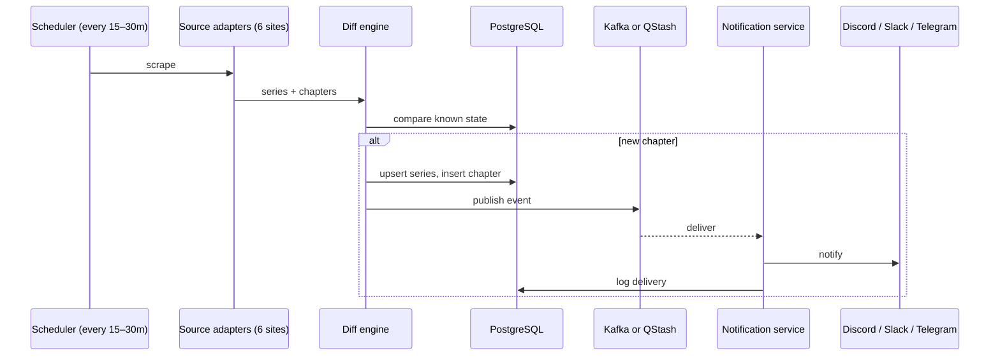
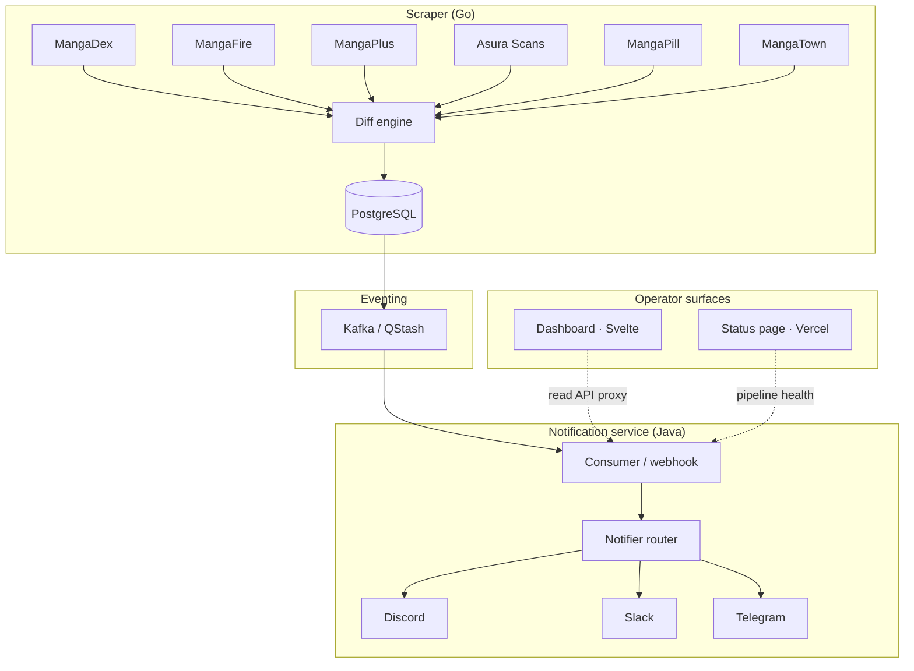
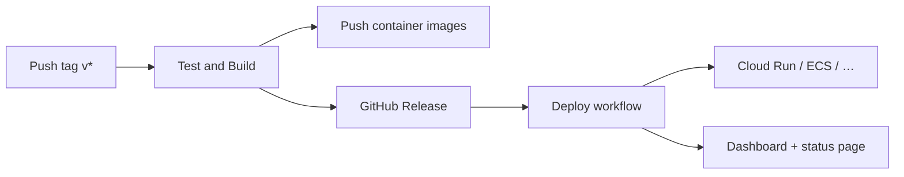

# manga-cdc

**Change Data Capture for manga releases** — scrape six sources, detect new chapters, stream events through Kafka, and notify Discord, Slack, or Telegram.

<p align="center">
  <a href="https://github.com/aeswibon/manga-cdc/actions/workflows/pull-request.yml?query=branch%3Amaster">
    
  </a>
  <a href="https://github.com/aeswibon/manga-cdc/actions/workflows/release.yml?query=branch%3Amaster">
    
  </a>
  <a href="LICENSE">
    
  </a>
  <a href="https://manga-cdc-status.vercel.app">
    
  </a>
  <a href="https://manga-cdc.vercel.app">
    
  </a>
  <a href="https://manga-cdc-status.vercel.app">
    
  </a>
  <a href="https://manga-cdc-status.vercel.app">
    
  </a>
</p>

<p align="center">
  <a href="https://manga-cdc.vercel.app"><strong>Dashboard</strong></a> ·
  <a href="https://manga-cdc-status.vercel.app"><strong>Status</strong></a> ·
  <a href="https://manga-cdc.openstatus.dev"><strong>OpenStatus</strong></a> ·
  <a href="CONTRIBUTING.md"><strong>Watchlist</strong></a> ·
  <a href="docs/security-model.md"><strong>Security</strong></a>
</p>

---

## Contents

- [Overview](#overview)
- [Architecture](#architecture)
- [Roadmap](#roadmap)
- [Quick start](#quick-start)
- [Project layout](#project-layout)
- [Development](#development)
- [Production](#production)
- [Documentation](#documentation)
- [License](#license)

---

## Overview

Manga chapters are scattered across MangaDex, MangaPlus, MangaFire, Asura Scans, MangaPill, and MangaTown — each with different APIs, schedules, and anti-bot behavior. manga-cdc runs a scheduled scrape → diff → notify pipeline so you stop checking sites by hand.

| Layer | Role |
|-------|------|
| **Scraper (Go)** | Source adapters, diff engine, DB writes, optional Kafka/QStash publish |
| **PostgreSQL** | Series, chapters, notification log |
| **Kafka / QStash** | Durable chapter events to the notifier |
| **Notifier (Spring Boot)** | Webhook consumer, channel routing, read API |
| **Dashboard & status page** | Operator UI (Svelte) + public health (Vercel) |



---

## Architecture



**Production** targets managed Postgres + Kafka (e.g. [Aiven](https://aiven.io)) with Cloud Run, ECS, Container Apps, or Helm on Kubernetes. **Local dev** uses Docker Compose (Postgres + Redpanda) via the [configure wizard](#quick-start).

| Choice | Rationale |
|--------|-----------|
| Go scraper | Fast cold start, low memory, strong concurrency for parallel fetches |
| Spring Boot notifier | Mature Kafka/JDBC integrations and notification SDKs |
| Kafka | At-least-once delivery, consumer groups, Debezium-compatible payloads |
| Svelte dashboard | Lightweight operator UI with server-side API proxy for secrets |

---

## Roadmap

Release train (current focus **v0.5.0** — reader notifications):

| Version | Theme |
|---------|--------|
| **v0.5.0** | Mass-release batching, watchlist notification prefs, group/binge/leak filters |
| **v0.6.0** | Multi-source fallback, hiatus/schedule hints |
| **v0.7.0** | Watchlist linter, fast-retry, dashboard ops |
| **v0.8.0** | Discord community (roles, `/subscribe`) |
| **v0.9.0** | Homelab archive (CBZ, OPDS, RSS, webhooks) |
| **v1.0.0** | Phase 1 complete (self-hosted operator product) |
| **v2.0.0+** | SaaS platform, then WAL CDC / ecosystem |

Based on [`docs/superpowers/plans/2026-06-13-future-roadmap.md`](docs/superpowers/plans/2026-06-13-future-roadmap.md) and the [original pipeline spec](docs/superpowers/specs/2026-06-10-mangastream-cdc-pipeline-design.md).

### Shipped

| Area | Status |
|------|--------|
| Six source adapters | MangaDex, MangaPlus, MangaFire, Asura, MangaPill, MangaTown |
| Auto-migrations | `goose` on scraper startup |
| Scraper health & zero-result alerts | `/healthz`, `/readyz`, Prometheus metrics |
| Mock HTML adapter tests | Offline fixture parsing in CI |
| Serverless scraper | GCP Cloud Run Jobs, AWS Fargate, Azure Container Apps, DO App Platform |
| Multi-cloud Terraform + Helm | GCP, AWS, Azure, DigitalOcean |
| Configure CLI wizard | Manifest-driven local/prod compose generation |
| Operator dashboard | Svelte + Tailwind — watchlist, logs, stats, themes, PWA |
| Public status page | Pipeline health via Vercel, cron-polled `/api/status` |
| Community watchlist | PR-driven [`data/watchlist.yaml`](data/watchlist.yaml) |
| Production security | API keys, webhook auth, rate limits, CORS — see [security model](docs/security-model.md) |
| Observability | Prometheus + Grafana locally; Grafana Cloud + Alloy in prod |
| **v0.4.0 production ops** | Vercel dashboard proxy/bootstrap, PWA update banner, Cloud Run cost profile (2h scraper, CDC off serverless), pipeline health cache |
| **v0.5.0 (in progress)** | Watchlist `notifications` prefs, mass-release batching in notifier |

### Pending

| Priority | Item | Notes |
|----------|------|-------|
| **Dashboard** | In-app series editor | Today: edit watchlist via PR only |
| **Dashboard** | Rich telemetry views | Basic stats exist; deeper scraper/run history still light |
| **Platform** | Multi-user subscriptions | `users` / `user_subscriptions` tables + per-user routing |
| **Scraper** | Anti-bot bypass | FlareSolverr, proxy/UA rotation, `chromedp` fallback |
| **Bots** | Discord / Telegram commands | `/track`, `/latest`, `/my-subscriptions` |
| **Media** | CBZ archiver | Download pages → `.cbz` for Kavita/Komga |
| **Data** | Metadata resolver | AniList/MAL synonym merge |
| **Security** | Encrypted webhook URLs | `pgcrypto` at rest |
| **Architecture** | True Debezium WAL CDC | Replace scraper dual-write with Postgres logical replication |
| **Architecture** | Avro + schema registry | Binary events via Confluent/Aiven registry |

---

## Quick start

```bash
git clone https://github.com/aeswibon/manga-cdc.git
cd manga-cdc

# Interactive setup (local or production tier)
go run ./configure

# Or regenerate from a saved manifest
cp config/manga-cdc.example.yaml config/manga-cdc.yaml
go run ./configure generate

# Local stack
docker compose up -d --build
```

| Service | URL (local) |
|---------|-------------|
| Dashboard | http://localhost |
| Status page | http://localhost:3001 |
| Notifier API | http://localhost:8080/api/logs?limit=50 |
| Pipeline health | http://localhost:8080/api/pipeline/health |
| Scraper metrics | http://localhost:2112/metrics |
| Grafana | http://localhost:3000/d/manga-cdc-overview/manga-cdc |

To track new series, open a PR against [`data/watchlist.yaml`](data/watchlist.yaml) — see [CONTRIBUTING.md](CONTRIBUTING.md).

---

## Project layout

```
manga-cdc/
├── configure/           # Setup wizard (manifest + generators)
├── config/              # Example manifest, Prometheus scrape config
├── scraper/             # Go scraper, adapters, diff, migrate
├── notification-service/# Spring Boot notifier + security layer
├── dashboard/           # Svelte operator UI (+ Vercel API proxy)
├── status-page/         # Public health page (Vercel)
├── data/watchlist.yaml  # Community-curated series list
├── db/migrations/       # SQL schema (goose)
├── terraform/           # GCP · AWS · Azure · DigitalOcean
├── helm/manga-cdc/      # Kubernetes chart
├── grafana/dashboards/  # manga-cdc overview JSON
└── docs/                # cloud-setup, security-model, design specs
```

---

## Development

### Docker Compose (recommended)

```bash
docker compose up -d --build
```

### Manual processes

```bash
docker compose up -d postgres
cd scraper && go run ./cmd/scraper
cd notification-service && ./mvnw spring-boot:run
```

### Tests

```bash
cd scraper && go test ./...
cd notification-service && ./mvnw test
cd dashboard && bun test && bun run build
cd status-page && npm ci && npm run typecheck
python scripts/validate-watchlist.py
```

### New source adapter

Implement `SourceAdapter` in `scraper/internal/adapter/`:

```go
type SourceAdapter interface {
    Name() string
    FetchLatest(ctx context.Context) ([]model.Series, error)
    FetchChapters(ctx context.Context, seriesID string) ([]model.Chapter, error)
}
```

Environment variables are documented in `.env.example` (generated by the configure wizard).

---

## Production

Recommended path: **GCP serverless** (Cloud Run notifier + Cloud Run Job scraper + Cloud Scheduler). Full bootstrap, secrets, and provider-specific notes live in [docs/cloud-setup.md](docs/cloud-setup.md) and [terraform/README.md](terraform/README.md).

### Prerequisites

| Service | Purpose |
|---------|---------|
| PostgreSQL 16 | Series/chapter state |
| Kafka (SASL_SSL) | Chapter events |
| Discord / Slack / Telegram | At least one notifier channel |
| GitHub Actions | CI/CD |

### Secrets checklist

Set in **GitHub → Settings → Secrets and variables** before tagging a release:

| Required | Name |
|----------|------|
| Cloud routing | `DEPLOY_CLOUD`, `DEPLOY_TARGET`, `DEPLOY_METHOD` |
| GCP auth | `GCP_PROJECT_ID`, `GCP_REGION`, `TF_STATE_BUCKET`, WIF provider + SA |
| App | `DATABASE_URL`, `KAFKA_*`, notifier webhooks |
| Security | `API_READ_KEY`, `WEBHOOK_SECRET`, QStash signing keys |
| Variable | `ALLOWED_ORIGINS`, `VITE_STATUS_PAGE_URL`, `VITE_DASHBOARD_URL` |

Vercel **dashboard** needs `NOTIFIER_URL` and `NOTIFIER_API_KEY`. The **status page** needs `KV_REST_API_URL` and `KV_REST_API_TOKEN` on Vercel; GitHub stores poller secrets (`PIPELINE_HEALTH_URL`, `API_READ_KEY`, KV credentials). Details: [docs/security-model.md](docs/security-model.md).

### Release flow

Pushes to `master` run **tests only**. Production deploys happen on **version tags**:

```bash
git tag -s v0.4.0 -m "v0.4.0"
git push origin v0.4.0
```



1. **Test and Build** — Go/Java/dashboard tests, Terraform matrix, E2E, image build on tags  
2. **Deploy** — Terraform or direct image update (GCP serverless by default)  
3. **Verify** — Notifier health, authenticated `/api/pipeline/health`, public status page  

After the first Terraform deploy, switch to faster image-only updates:

```bash
gh secret set DEPLOY_METHOD --body "direct"
```

### CI workflows

| Workflow | Trigger | Purpose |
|----------|---------|---------|
| **Test and Build** | PR, `master`, tags `v*` | Tests, snapshots, release images |
| **Deploy** | Successful tag pipeline | Backend + optional Vercel |
| **Watchlist validation** | PRs touching `data/watchlist.yaml` | Fast YAML checks |

---

## Documentation

| Document | Description |
|----------|-------------|
| [CONTRIBUTING.md](CONTRIBUTING.md) | Community watchlist PR guide |
| [docs/security-model.md](docs/security-model.md) | Trust boundaries, secrets, operator checklist |
| [docs/cloud-setup.md](docs/cloud-setup.md) | Multi-cloud deploy guide |
| [terraform/README.md](terraform/README.md) | Bootstrap, variables, outputs |
| [status-page/README.md](status-page/README.md) | Vercel status page setup |
| [dashboard/README.md](dashboard/README.md) | Dashboard dev notes |

Design specs and the full future roadmap live under `docs/superpowers/` (local agent docs; not committed to CI).

---

## License

MIT — see [LICENSE](LICENSE).
