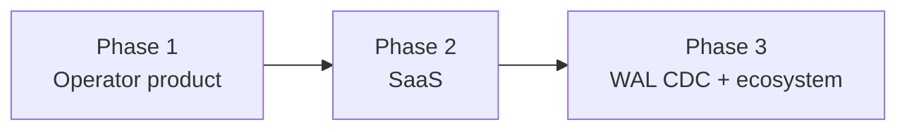

# Part 1 — Problem, goals & constraints

[← Series index](./README.md) · [Next: System architecture →](./02-system-architecture.md)

## Decision summary

manga-cdc is a **single-tenant operator pipeline** (Phase 1) that automates multi-source manga chapter detection and notification. We optimize for **provable end-to-end behavior** on real sites, **portable deployment** (BYO Postgres + eventing), and a **credible path to true CDC** — not for multi-user SaaS or minimum LOC on day one.

---

## The problem (systems view)

### User pain

Readers follow series across **heterogeneous sources**: official APIs (MangaDex, Manga Plus), HTML aggregators (MangaFire, MangaPill, MangaTown), and scanlation sites (Asura). Each source has:

- Different **auth and rate limits**
- Different **HTML/API stability** (layout changes break scrapers)
- Different **release semantics** (simulpub vs fan upload vs batch dumps)

Manual checking does not scale; a single cron + RSS per site does not unify **diff state** or **notification policy**.

### Technical pain

A naïve “scraper + Discord webhook” script fails on:

| Failure | Why it matters |
|---------|----------------|
| **Duplicate notifications** | Retries, republication, mass-release dumps |
| **Lost notifications** | Process crash between DB write and webhook |
| **Untrusted writes** | Public webhook endpoints get probed |
| **Ops blindness** | No health surface when a source silently returns zero rows |
| **Deploy fragility** | Hard-coded URLs and secrets in one script |

manga-cdc treats this as a **small distributed system**: ingest, durable state, event delivery, policy layer, operator UI.

---

## Goals (ranked)

From the original pipeline spec — **order matters** when trade-offs conflict:

| Priority | Goal | PE interpretation |
|----------|------|-------------------|
| 1 | **Real** | Production incidents come from real site changes; tests use fixtures but CI must not lie about live behavior |
| 2 | **Impressive** | Multi-cloud IaC, CI gates, observability hooks — credibility for contributors and employers |
| 3 | **Educational** | Patterns (adapter boundary, Debezium-shaped events, BFF proxy) are reusable in other domains |

When goals conflict:

- **Real > Impressive** — we ship mock adapter tests but not at the expense of an e2e path on tagged releases.
- **Impressive ≠ Complex for its own sake** — four Terraform clouds is portability, not fetishism; each module shares env parsing patterns.

---

## Product phases & risk budget



| Phase | What we buy | What we defer |
|-------|-------------|---------------|
| **Phase 1** (→ v1.0) | Working pipeline, community watchlist, public dashboard | Per-user auth, billing, in-app editing |
| **Phase 2** (v2.0) | `users`, subscriptions, tenant isolation | Commerce, cross-operator federation |
| **Phase 3** (v3.0) | Debezium WAL, Avro registry | Breaking notifier contract |

### Why phased delivery?

**Principal-engineer framing:** Each phase changes the **threat model** and **data ownership model**. SaaS (Phase 2) requires row-level security, PII handling, and abuse controls that are wasted work if the scrape→notify loop is not stable. True CDC (Phase 3) requires replication slots and connector ops that conflict with **$0 scale-to-zero** serverless goals in Phase 1.

Phase 1 therefore uses **application-level CDC**:

```
INSERT chapter → publish Debezium-shaped JSON → notifier
```

This is a deliberate **strangler fig** pattern: the notifier consumer stays stable when we replace publish with WAL capture later ([Part 4](./04-database-and-eventing.md)).

---

## Explicit non-goals (Phase 1)

| Non-goal | Rationale | Revisit when |
|----------|-----------|--------------|
| Dashboard series CRUD in prod | Avoids admin API + audit + abuse on public deployment | v0.7 dashboard ops or Phase 2 |
| Hiding architecture in private repo | Community watchlist + education; security = secrets + boundaries | Never (by design) |
| Debezium on Cloud Run Job | Connector JVM + slot management exceeds Job memory/time | VM homelab (v0.9) or Phase 3 |
| Sub-second notification latency | Hobby operator; 2h scrape cadence is acceptable | If SaaS SLAs require it |
| Perfect anti-bot | Arms race; FlareSolverr/proxy is roadmap, not baseline | v0.6+ resilience work |

---

## Constraints that shaped architecture

These are **hard inputs**, not preferences:

| Constraint | Architectural consequence |
|------------|---------------------------|
| **Public GitHub repo** | No security through obscurity; webhook shape is documented |
| **Hobby / low monthly spend** | GCP serverless, scale-to-zero, 2h scraper schedule |
| **BYO managed Postgres** | Neon/Aiven-compatible URL parsing; read replica optional |
| **BYO eventing** | Kafka *or* QStash — not one vendor lock-in |
| **Protected `master` + signed tags** | Release train, `RELEASE_BOT_TOKEN`, version-sync bot |
| **Six heterogeneous sources** | Adapter interface + HTML fixture tests |

---

## Personas & trust

| Persona | Trust level | Implication |
|---------|-------------|-------------|
| **Watchlist contributor** | Semi-trusted (PR + CI) | YAML validation; no arbitrary code in watchlist |
| **Anonymous dashboard visitor** | Untrusted reader | Read-only proxy; same data as UI |
| **Operator** | Trusted | Holds API keys, Terraform, Vercel env |
| **External sites** | Untrusted input | Parsing validation, URL allowlists on cover proxy |

---

## Alternatives considered (charter level)

| Option | Pros | Cons | Verdict |
|--------|------|------|---------|
| **IFTTT / RSS only** | Zero code | No unified diff; no group/binge filters | Rejected |
| **Single-site bot (Discord-only)** | Fast | Does not match multi-source reality | Rejected |
| **Monorepo microservices (5+ services)** | Pure separation | Ops overhead for one operator | Rejected |
| **Go-only or Java-only** | One toolchain | Weak scraping *or* weak Kafka integration | Rejected — split at natural seam |
| **SaaS from day one** | Revenue path | 10× auth, billing, support surface | Deferred to Phase 2 |
| **Managed “scraper API” dependency** | Less maintenance | Cost, ToS, no control when API changes | Rejected |

---

## Invariants (charter)

Do not violate these without an explicit ADR and migration plan:

1. **Postgres is source of truth** for “what chapters exist.”
2. **Notifier does not scrape** external manga sites.
3. **Watchlist changes in prod** go through Git (or future audited admin API), not anonymous HTTP.
4. **Event envelope** remains Debezium-compatible until v3 schema registry work.
5. **Phase 1 remains single-tenant** — no implicit multi-user data paths.

---

## Change checklist (before expanding scope)

- [ ] Does this feature assume **per-user state**? → Phase 2 gate.
- [ ] Does it require **new secrets in the browser**? → Security review ([Part 7](./07-security-rationale.md)).
- [ ] Does it add **always-on compute**? → Cost review ([Part 9](./09-observability-and-cost.md)).
- [ ] Does it break **idempotent notification**? → Notifier review ([Part 5](./05-notification-service.md)).

---

## Next

- [Part 2 — System architecture](./02-system-architecture.md) — coupling, consistency, seams
- [Part 11 — Roadmap & evolution](./11-roadmap-and-evolution.md) — semver themes
