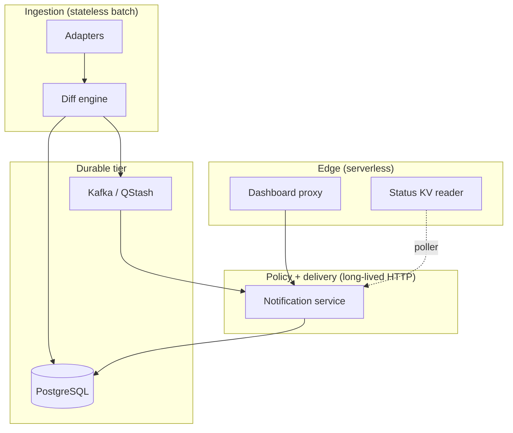

# Part 2 — System architecture

[← Part 1](./01-problem-and-goals.md) · [Series index](./README.md) · [Next: Scraper →](./03-scraper-and-source-adapters.md)

## Decision summary

manga-cdc is a **four-box pipeline** (scraper, Postgres, event bus, notifier) plus **two edge surfaces** (dashboard BFF, status KV). We split **Go vs Java** at the scrape/notify seam, keep **Postgres authoritative**, and use **Debezium-shaped events** as the stable contract between write path and policy path.

---

## Logical architecture



### Why these boxes?

| Box | Stateful? | Scaling unit | Failure isolation |
|-----|-----------|--------------|-------------------|
| Scraper | No (Job) | Per schedule run | Bad adapter does not crash notifier |
| Postgres | Yes | Managed instance | Central coordination point |
| Event bus | Yes (offsets/delivery) | Managed | Decouples scrape latency from notify latency |
| Notifier | Yes (pools, caches) | Cloud Run service | Channel failure ≠ scrape failure |
| Edge | Ephemeral cache | Vercel region | UI down ≠ pipeline down |

---

## Consistency model (PE-critical)

This is **not** linearizable end-to-end. Understand what is guaranteed:

| Step | Guarantee | Gap |
|------|-----------|-----|
| DB insert of new chapter | **ACID** per transaction | — |
| Event publish after insert | **Best effort** in same process | Crash after commit, before publish → `is_new` remains true |
| Bus delivery | **At-least-once** (Kafka/QStash) | Duplicates possible |
| Notification | **Idempotent** via DB checks + `is_new` | Mis-ordered events rare but handled |
| Dashboard read | **Eventually consistent** | Replica lag if read pool used |

**We explicitly accept** a small dual-write window (insert vs publish) in Phase 1 instead of running transactional outbox + Debezium today. Mitigations:

- `is_new` flag allows notifier to process DB-only recovery paths in future.
- QStash/Kafka retries cover transient publish failures.
- Scraper logs publish errors; chapters remain visible in dashboard.

**Future:** transactional outbox table or WAL CDC removes dual-write from application code ([Part 4](./04-database-and-eventing.md)).

---

## Service boundaries & forbidden dependencies

```
┌─────────────┐     ┌─────────────┐     ┌─────────────┐
│  Scraper    │ ──► │  Postgres   │ ◄── │  Notifier   │
│  (Go)       │     │             │     │  (Java)     │
└──────┬──────┘     └─────────────┘     └──────┬──────┘
       │                                         │
       └──────────► Event bus ◄─────────────────┘
```

| Allowed | Forbidden |
|---------|-----------|
| Scraper → Postgres, bus | Scraper → Discord directly |
| Notifier → Postgres, bus, webhooks | Notifier → MangaDex HTTP |
| Dashboard → Notifier (GET, proxied) | Browser → Notifier with embedded API key |
| Status poller → Notifier (health) | Status page browser → Notifier |

**Why forbid notifier scraping?** Coupling read API to external sites introduces **CORS, rate limits, and blocking** into the latency-sensitive operator path. Scraping failures must not take down `/api/series`.

---

## Language split: Go scraper + Java notifier

### Decision

| Service | Language | Primary dependencies |
|---------|----------|----------------------|
| Scraper | Go 1.22+ | pgx, kafka-go, colly/http |
| Notifier | Java 21 / Spring Boot 3 | Spring Kafka, JDBC, webhook SDKs |

### Rationale (senior-dev depth)

**Go for scraper**

- Goroutines + low memory fit **parallel per-source fetches** on a 512 MiB Cloud Run Job.
- `kafka-go` is pure Go (no librdkafka cgo) — smaller container, simpler cross-compile to `linux/amd64`.
- Fast cold start for **run-to-completion** Jobs.

**Java for notifier**

- Spring Kafka consumer lifecycle, error handlers, and offset commit semantics are **boring in a good way**.
- JDBC + HikariCP + multiple notification SDKs in one process without reinventing middleware.
- Servlet filter stack for **webhook signature verification** and rate limits.

**Cost of split**

- Two CI test matrices, two container images, two sets of observability conventions.
- Shared contract is **SQL schema + JSON event shape** — not shared code.

**When we would merge stacks:** Never required for Phase 1. If team were Go-only, we'd use `segmentio/kafka-go` consumer + `pgx` in notifier — viable but reimplements Spring security filters and metrics integration.

---

## Data flows (three paths)

### Path A — Scrape → notify (critical path)

See sequence diagram in [README](../../README.md#overview). P95 latency is dominated by **external site RTT**, not internal RPC.

### Path B — Dashboard read (high fan-out)

```
Browser → Vercel Edge → Cloud Run → Postgres (read pool)
```

Designed for **many anonymous readers**, one API key. Caching at Edge and bootstrap aggregation reduce **duplicate `/api/series`** calls ([Part 6](./06-operator-surfaces.md)).

### Path C — Public health (low frequency)

```
GitHub Actions (5 min) → /api/pipeline/health → Vercel KV → Browser
```

Decouples **deep health** from **public internet** ([Part 7](./07-security-rationale.md)).

---

## Extension seams (where to plug in)

| Seam | Mechanism | Stable contract |
|------|-----------|-----------------|
| New manga source | `SourceAdapter` + watchlist `source` key | Adapter interface |
| New notification channel | `Notifier` + env config | `NotifierRegistry` |
| New per-series policy | `notification_prefs` + YAML block | JSON prefs schema |
| New cloud | Terraform module + `deployment_target` | Container images + env vars |
| New event transport | Publisher in scraper + consumer/webhook in notifier | Debezium JSON envelope |

**Anti-pattern:** Adding business logic in Terraform or Vercel Edge that should live in notifier policy layer.

---

## Deployment topology vs logical architecture

The **same images** run as:

- Cloud Run Job + Service (serverless)
- Docker Compose on VM (always-on)
- Helm pods (Kubernetes)

Logical architecture does not change — only **scheduling, networking, and sidecars** do ([Part 8](./08-deployment-topology.md)).

Serverless prod **disables Kafka consumer** (`CDC_ENABLED=false`) when using QStash-only — logical bus still exists; physical transport switches.

---

## Failure modes (system level)

| Symptom | Likely layer | First checks |
|---------|--------------|--------------|
| No Discord messages, dashboard shows chapters | Notifier / webhooks | `notification_log`, channel env vars |
| Dashboard 502 on bootstrap | Notifier / DB / creds | Cloud Run logs, read replica env |
| Status page stale | Poller / KV | `health-poller.yml` run, KV TTL |
| Zero series updates | Scraper / source | Scraper metrics, zero-result alert |
| Duplicate spam | Notifier policy | Batching window, `is_new` handling |

---

## Alternatives considered

| Architecture | Why not chosen |
|--------------|----------------|
| **Lambda per source** | Six cold starts; shared DB pool harder; Go Job batch is simpler |
| **Single “worker” monolith** | Scraping blocking notify API threads; poor scale shapes |
| **GraphQL federation** | Two clients (dashboard, notifier); REST + bootstrap sufficient |
| **Event sourcing (full)** | Overkill; Postgres rows + events enough for Phase 1 |
| **CQRS read models** | Read replica + JDBC is lighter than projector services |

---

## Invariants

1. Scraper is the **only writer** of `chapters` from external truth (admin mutations excepted and off in prod).
2. Event payloads must remain parseable by `ChapterEventService` without scraper-specific fields.
3. Dashboard proxy is **GET-only** for notifier paths.
4. Notifier security filters run **before** controllers (`@Order(HIGHEST_PRECEDENCE)`).

---

## Change checklist

- [ ] Does a new component **call external manga sites**? → Must live in scraper.
- [ ] Does it introduce **second event schema**? → Requires versioned consumer or Phase 3 registry.
- [ ] Does it require **synchronous scrape→notify**? → Conflicts with bus; justify strongly.
- [ ] Cross-service transaction needed? → Use outbox or accept documented inconsistency window.

---

## Next

- [Part 3 — Scraper](./03-scraper-and-source-adapters.md)
- [Part 4 — Database & eventing](./04-database-and-eventing.md)
