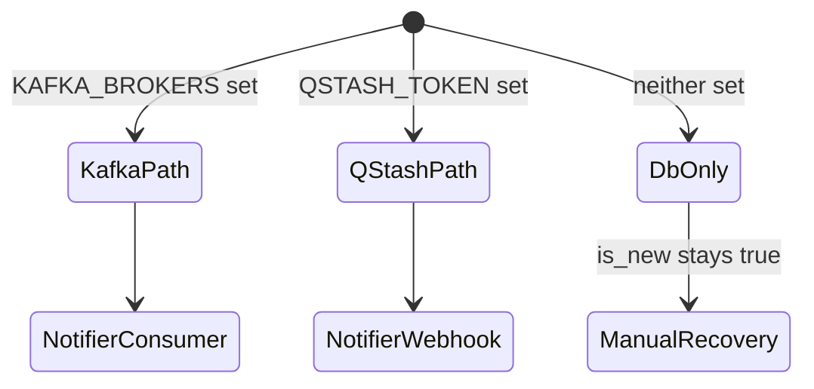

# Part 4 — Database & eventing

[← Part 3](./03-scraper-and-source-adapters.md) · [Series index](./README.md) · [Next: Notification service →](./05-notification-service.md)

## Decision summary

**PostgreSQL** is the system of record. Chapter detection events are **application-published** in **Debezium-compatible JSON** to **Kafka and/or QStash**. The notifier consumes the same shape via Kafka listener or HTTP webhook. **True WAL CDC** is a Phase 3 replacement of the publish step, not a consumer rewrite.

---

## Schema design (why these tables)

### Core entities

| Table | Role | Key design choice |
|-------|------|-------------------|
| `manga_series` | Tracked titles | `source_id` unique — namespaced external ID |
| `chapters` | Chapter rows | `UNIQUE(series_id, chapter_num)` — idempotent inserts |
| `notification_log` | Delivery audit | Append-only operational history |
| `notification_prefs` | Per-series policy | Synced from YAML — notifier reads without Git |

### Type decisions

| Column | Type | Rationale |
|--------|------|-----------|
| `chapter_num` | `DECIMAL(10,1)` | Supports `.5` chapters (common in web serials) |
| `last_checked`, `release_date` | `TIMESTAMPTZ` | Scraper/notifier use `Instant` in Java — custom `RowMapper` required |
| `notification_prefs` | JSONB | Evolve prefs without migration per field |
| Primary keys | UUID | No coordination for ID generation across services |

**Deferred:** `users` / `user_subscriptions` tables (Phase 2) — do not add foreign keys that assume multi-tenancy until ADR.

---

## Migration system

- **Tool:** goose (`db/migrations/*.sql`)
- **Runner:** Go scraper (`scraper/internal/migrate/`)
- **Baseline detection:** Existing prod DBs may skip already-applied versions

### PE concerns

| Risk | Mitigation |
|------|------------|
| Java + Go schema drift | Single migration directory |
| Non-idempotent DDL | `IF NOT EXISTS` where re-run possible |
| Long migration on Neon | Run in maintenance window; scraper Job retry-tolerant |
| initdb.d double-apply (dev) | E2e uses explicit network migrate |

---

## Eventing: three modes



### Mode comparison (production-relevant)

| Dimension | Kafka (managed) | QStash | DB-only |
|-----------|-----------------|--------|---------|
| Transport | TCP + SASL_SSL | HTTPS | — |
| Consumer | Spring `@KafkaListener` | `POST /api/webhook` | None |
| Retry | Consumer offset + broker | Upstash retry policy | Operator |
| Cold start / serverless | Persistent conn cost | Request-native | N/A |
| Ordering | Per-partition | Not guaranteed | — |
| Ops complexity | Cluster ACLs, topic | Token + signing keys | Lowest |

**Why support both Kafka and QStash?**

Operators have different **existing contracts**:

- Homelab / VM often already runs Redpanda locally.
- GCP serverless operator may prefer **no persistent Kafka connection** from Cloud Run Job (egress, SASL handshake, secret rotation).

Scraper wires **both publishers conditionally** — they are not mutually exclusive in code, but prod typically enables one.

---

## Debezium-shaped envelope (contract)

```json
{
  "op": "c",
  "after": {
    "id": "uuid",
    "series_id": "uuid",
    "chapter_num": 42.0,
    "title": "...",
    "url": "https://...",
    "is_new": true,
    "scan_group": "..."
  }
}
```

### Why mimic Debezium without Debezium?

| Reason | Detail |
|--------|--------|
| **Strangler migration** | Swap scraper publish → WAL connector; consumer unchanged |
| **Education** | Same learning curve as production CDC pipelines |
| **Interoperability** | Future tools expecting CDC ops (`c` = create) |

`ChapterEventService` filters `op == "c"` and `after.is_new == true` — same as a real Debezium consumer would.

### Schema evolution (today)

- **JSON without registry** — fields can be added to `after` if consumer ignores unknowns.
- **Breaking changes** require coordinated deploy (Phase 3 Avro).

---

## Dual-write semantics (honest assessment)

Current path:

```
BEGIN; INSERT chapter; COMMIT;
publish(event)  // separate step
```

| Failure order | Outcome | Recovery |
|---------------|---------|----------|
| Insert fails | No event | Scraper retries scrape |
| Insert ok, publish fails | `is_new=true`, no notify | Fix bus; optional replay job |
| Publish ok, insert rolled back | Rare (same process) | Consumer DB check fails — safe |
| Duplicate publish | Multiple events | Idempotent notifier |

**Not yet shipped:** transactional outbox table (`outbox_events` inserted in same TX, separate relay). Would be the Phase 1.5 hardening step before Debezium.

---

## Read replica routing (notifier)

### Decision

- **Writes:** primary `JdbcTemplate` (notification log, marking notified, prefs updates)
- **Reads:** `readJdbcTemplate` when `SPRING_DATASOURCE_READ_URL` set

Terraform parses `DATABASE_READ_URL` into JDBC URL + username + password env vars (`terraform/gcp/main.tf`).

### Why replicas for a hobby project?

| Driver | Explanation |
|--------|-------------|
| Neon pooler model | Read pooler is **free scale-out** for SELECT-heavy dashboard |
| Prod incident | Dashboard bootstrap hammers `/api/series` — offloads primary |
| Read-your-writes | Not required for UI — 1–2s replica lag acceptable |

### Implementation notes (`DatabaseConfig.java`)

- Separate `ReadDataSourceProperties` — avoids duplicate `DataSourceProperties` Spring bean clash (e2e discovered this).
- Credentials must be explicit for read pool — **inferring from `@Lazy` primary Hikari** failed on Cloud Run with SCRAM “empty password” at startup.
- Fallback: read username/password from env, then primary credentials.

**Invariant:** If read URL set without creds, notifier may **fail closed** at startup — prefer loud failure over silent primary fallback.

---

## Kafka vs QStash reliability comparison

From QStash design spec — expanded:

| Aspect | Kafka | QStash |
|--------|-------|--------|
| Delivery guarantee | At-least-once (consumer commit) | At-least-once HTTP retry |
| Backpressure | Consumer lag metric | QStash queue depth (vendor) |
| Poison message | DLQ pattern (manual) | Failed delivery dashboard |
| Latency | ~ms on persistent conn | ~100ms+ per HTTP hop |
| Security | SASL + TLS | Bearer + signing on delivery |
| Local dev | Redpanda in compose | Not wired locally (by design) |

**Serverless prod profile:** `CDC_ENABLED=false` disables Kafka **consumer** in notifier when operator uses QStash-only — avoids idle Kafka connections on scale-to-zero service.

---

## Future: true WAL CDC

```
Postgres logical replication → Debezium → Kafka → Notifier
```

| Blocker (serverless) | Blocker (managed Postgres) |
|----------------------|----------------------------|
| No long-lived Connect worker on Cloud Run | Replication slot disk retention |
| Job cannot host JVM connector | Neon/Aiven slot config |

**Likely landing:** VM/K8s homelab first (v0.9), consumer still `ChapterEventService`.

---

## Failure modes

| Symptom | Diagnosis |
|---------|-----------|
| Chapters in DB, no events | Publisher nil / wrong env / publish error logs |
| Events, no notify | Consumer off, webhook auth fail, filter blocked |
| `ConversionNotSupportedException` on `/api/series` | JDBC `Timestamp` mapping — use custom RowMapper |
| Read replica 503 on deploy | `SPRING_DATASOURCE_READ_*` creds missing |
| Duplicate notifications | At-least-once + batch flush race — check idempotency |

---

## Alternatives considered

| Option | Why not |
|--------|---------|
| LISTEN/NOTIFY | No persistence across disconnect |
| Redis streams | Extra system; Kafka/QStash already cover |
| S3 event log | Higher latency; SQL queries needed anyway |
| Single combined JDBC URL with creds in URL only | Breaks Spring Boot property split; Terraform standardizes split |
| ORM (JPA) | `DataClassRowMapper`/`Instant` pain; explicit SQL clearer |

---

## Change checklist

- [ ] Migration backward-compatible for **existing Neon** prod?
- [ ] Event field additive only, or consumer updated in same release?
- [ ] Read replica env vars set in **Terraform + deploy workflow**?
- [ ] Dual-write failure mode documented in PR?
- [ ] Does new index block scrape writes during `CREATE INDEX CONCURRENTLY`?

---

## Next

- [Part 5 — Notification service](./05-notification-service.md)
- [Part 8 — Deployment](./08-deployment-topology.md) — Neon secrets
