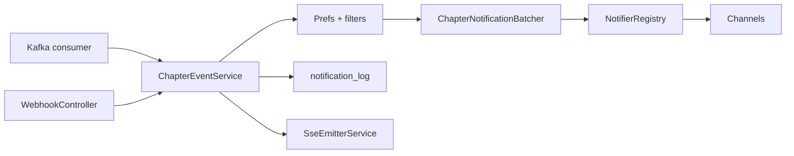

# Part 5 — Notification service

[← Part 4](./04-database-and-eventing.md) · [Series index](./README.md) · [Next: Operator surfaces →](./06-operator-surfaces.md)

## Decision summary

The notification service is a **Spring Boot policy engine**: it validates chapter events, applies **per-series preferences and filters**, delivers to **multiple channels**, and exposes a **read API** for operators. Ingestion is **dual-path** (Kafka + webhook) into one `ChapterEventService`. Security is **fail-closed** by default in Terraform prod.

---

## Why Spring Boot (not a second Go service)?

| Capability | Effort in Java (shipped) | Effort in Go |
|------------|--------------------------|--------------|
| Kafka consumer groups | Spring Kafka | Build retry/offset logic |
| JDBC pooling + read split | Hikari + `@Qualifier` | `pgxpool` + manual routing |
| Webhook signature verify | Servlet filter + beans | Middleware from scratch |
| Rate limiting | In-memory filter | Same, but reinvents actuator |
| Micrometer metrics | First-class | prometheus client manual |

**Trade-off:** Heavier container (~200+ MiB JVM) vs richer integration. Cloud Run 256 MiB with CPU throttling is **intentionally tight** — we accept cold starts ([Part 9](./09-observability-and-cost.md)).

**Native image (GraalVM):** Evaluated in cloud-run balance design — **deferred**; build pipeline complexity vs marginal savings at current scale.

---

## Ingestion: single policy pipeline



### Kafka path

`KafkaChapterConsumer` delegates to `processChapterEvent(String message)`.

Enabled when `CDC_ENABLED=true` and brokers configured.

### Webhook path

`POST /api/webhook` — QStash signed delivery or `WEBHOOK_SECRET`.

`ApiSecurityFilter` reads body once, verifies auth **before** controller (`CachedBodyHttpServletRequest`).

### Why one service method?

| Alternative | Problem |
|-------------|---------|
| Separate webhook vs Kafka handlers | Policy drift; double maintenance |
| **Shared `ChapterEventService`** (shipped) | One test matrix for filters/batching |

---

## Security model (implementation)

Filter: `ApiSecurityFilter` (`@Order(HIGHEST_PRECEDENCE)`).

| Path | Auth |
|------|------|
| `/actuator/health` | Public (liveness only) |
| Other `/actuator/*` | API key |
| `POST /api/webhook` | QStash signature or webhook secret + rate limit |
| `/api/*` GET | API key + read rate limit |
| SSE `/api/logs/stream` | API key + per-IP connection cap |

**Fail-closed prod defaults** (Terraform):

```
SECURITY_REQUIRE_API_KEY=true
SECURITY_REQUIRE_WEBHOOK_AUTH=true
ADMIN_MUTATIONS_ENABLED=false
```

**Why public liveness only?** Cloud Run and uptime checks need unauthenticated health; **deep health** is on `/api/pipeline/health` behind API key.

---

## Event validation (anti-forgery)

Even with webhook auth, payload structure is public knowledge.

`ChapterEventService` validates:

1. `op == "c"` and `is_new == true`
2. Chapter exists in DB
3. **URL in event matches URL in DB** for that chapter ID

| Attack | Defense |
|--------|---------|
| Replay old event | `is_new` false after first notify |
| Forge chapter ID | DB row missing → drop |
| Swap URL to malware | URL mismatch → drop |

This is **application-layer integrity** on top of transport auth.

---

## v0.5 policy layer

Prefs loaded from `notification_prefs` (synced from watchlist YAML).

| Feature | Implementation | Rationale |
|---------|----------------|-----------|
| **Mass-release batching** | `ChapterNotificationBatcher` — per-series window (`NOTIFICATIONS_BATCH_WINDOW_SECONDS`) | 20 chapters at once → one Discord message |
| **Binge mode** | `notify_every: N` | Reader wants every 10th chapter only |
| **Group allow/deny** | `scan_group` on chapter row | Filter machine TL vs official |
| **Early-week leak** | `isEarlyWeekLeak(releaseDate)` heuristic | Reduce spoiler noise from early uploads |

### Why filter at notify time (not scrape time)?

| Scrape-time filter | Notify-time filter |
|------------------|-------------------|
| Chapter never in DB | Full history in dashboard |
| Cannot audit suppressed releases | `notification_log` can show SKIPPED (future) |
| Re-scrape if prefs change | Prefs apply retroactively on next event |

**PE trade-off:** More DB reads per event; acceptable at hobby scale.

### Batcher concurrency

`ChapterNotificationBatcher` uses per-series `ConcurrentHashMap` + single-thread scheduler — **serializes flush per series**, prevents interleaved Discord embeds for same title.

`batchWindowMs <= 0` → immediate send (tests, debugging).

---

## Notifier registry

`NotifierRegistry` iterates `DiscordNotifier`, `SlackNotifier`, `TelegramNotifier`.

| Pattern | Why |
|---------|-----|
| Interface per channel | Add channel without changing `ChapterEventService` |
| Env-gated enable | Missing webhook URL → skip silently |
| Per-channel error isolation | Slack fail does not block Telegram |

---

## Read API & repository layer

### Endpoints (operator-facing)

| Route | Backend | Read pool? |
|-------|---------|------------|
| `GET /api/series` | `SeriesRepository.findAll` | Yes |
| `GET /api/logs` | `NotificationLogRepository` | Yes |
| `GET /api/stats` | Aggregates | Yes |
| `GET /api/pipeline/health` | `PipelineHealthService` | Yes (cached) |

### Why JdbcTemplate, not JPA?

| JPA | JdbcTemplate (shipped) |
|-----|------------------------|
| Magic fetching | Explicit SQL in repositories |
| `Instant` mapping surprises | Custom `RowMapper` for timestamps |
| Heavier startup | Faster cold start on Cloud Run |

**Production lesson:** `DataClassRowMapper` + `Instant` caused `ConversionNotSupportedException` on `/api/series` — fixed with explicit mapper in `SeriesRepository`.

### Mutations

`MangaApiController` POST paths gated by `MutationGuard` + `ADMIN_MUTATIONS_ENABLED`.

Prod: **off** — series lifecycle is Git-driven.

---

## SSE (`/api/logs/stream`)

Real-time log tail for **local dev** and VM.

**Disabled in serverless cost profile** — long-lived connections prevent scale-to-zero and add FD pressure on small instances.

---

## Read/write datasource split

See [Part 4](./04-database-and-eventing.md).

**Caveat for PEs:** Spring Data JDBC `jdbcDialect` resolves against primary `DataSource` at startup — read pool misconfiguration must not break primary bean creation order. `ReadDataSourceProperties` as separate `@ConfigurationProperties` avoids bean definition clashes discovered in e2e.

---

## Failure modes

| Symptom | Likely cause |
|---------|--------------|
| 401 on dashboard proxy | `NOTIFIER_API_KEY` mismatch Vercel ↔ Cloud Run |
| 502 bootstrap | Upstream `/api/series` 500 — check RowMapper, DB |
| Webhook 401 | QStash signing keys rotation drift |
| Kafka lag | Consumer off (`CDC_ENABLED=false`) or broker creds |
| Spam after mass release | Batch window too small; tune `NOTIFICATIONS_BATCH_WINDOW_SECONDS` |
| Empty password SCRAM on deploy | Read replica creds missing in Terraform |

---

## Alternatives considered

| Option | Verdict |
|--------|---------|
| Serverless functions per channel | Cold start × 3; shared DB pool harder |
| Node.js notifier | Weaker Kafka + JDBC maturity in one deployable |
| Rules engine (Drools) | Overkill for four prefs |
| Push directly from scraper to Discord | No central policy/audit |
| GraphQL API | REST + bootstrap sufficient |

---

## Change checklist

- [ ] New filter logic covered in `ChapterEventServiceTest`?
- [ ] Idempotent under duplicate events?
- [ ] Does new endpoint need **read or write** pool?
- [ ] Security filter updated for new path prefix?
- [ ] SSE or long-poll — impact on serverless cost?

---

## Next

- [Part 6 — Operator surfaces](./06-operator-surfaces.md)
- [Part 7 — Security rationale](./07-security-rationale.md)
- [security-model.md](../security-model.md)
