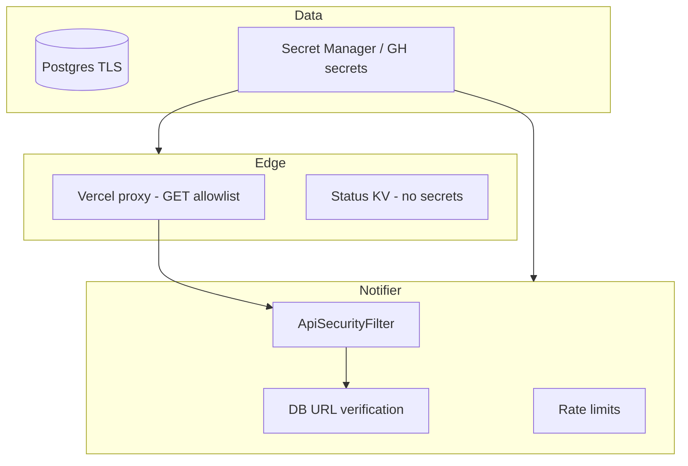

# Part 7 — Security rationale

[← Part 6](./06-operator-surfaces.md) · [Series index](./README.md) · [Next: Deployment →](./08-deployment-topology.md)

## Decision summary

Security is **defense in depth with public code**: secrets in vaults, **fail-closed** prod defaults, **app-layer verification** of webhook payloads, and **explicit acceptance** of residual risks (public read proxy, Cloud Run invoker). We do not rely on hiding API shapes.

**Operator checklist:** [security-model.md](../security-model.md)

---

## Threat model (Phase 1)

### Assets

| Asset | Sensitivity |
|-------|-------------|
| `DATABASE_URL` / read URL | Critical |
| `API_READ_KEY`, webhook secrets | High |
| Notifier channel webhooks | Medium (spam/abuse) |
| Watchlist / chapter metadata | Low–medium (public by product choice) |
| Pipeline health details | Low (sanitized public) |

### Threat actors

| Actor | Capability | Primary controls |
|-------|------------|------------------|
| Anonymous internet | HTTP to Cloud Run, Vercel | API key, webhook auth, rate limits |
| Watchlist contributor | PR to repo | CI validation, code review |
| Operator | Full secrets | GitHub/Vercel/GCP IAM |
| Compromised dependency | Supply chain | Pin actions, signed tags, minimal images |

### Out of scope (Phase 1)

- Nation-state adversaries
- Multi-tenant data isolation (no tenants yet)
- DDoS at CDN scale (Cloud Run + Vercel defaults only)

---

## Layered controls



---

## Notifier: fail-closed defaults

Terraform `cloud_run_env` sets:

```
SECURITY_REQUIRE_API_KEY=true
SECURITY_REQUIRE_WEBHOOK_AUTH=true
ADMIN_MUTATIONS_ENABLED=false
```

| Flag | If `false` in prod |
|------|---------------------|
| `SECURITY_REQUIRE_API_KEY` | Anyone harvests `/api/series` |
| `SECURITY_REQUIRE_WEBHOOK_AUTH` | Forged chapter spam to Discord |
| `ADMIN_MUTATIONS_ENABLED` | Remote series injection |

**PE rule:** Never merge Terraform defaults that weaken these without ADR + operator sign-off.

### Cloud Run `allUsers` invoker

Required for QStash delivery and some health probes.

| Mitigation | Why sufficient for Phase 1 |
|------------|----------------------------|
| App-layer auth on all sensitive routes | Network public ≠ authorized |
| Rate limits | Slow brute force on API key |
| No admin in prod | Reduces write blast radius |

**Alternative:** IAM-only invoker + QStash static egress allowlist — more moving parts; revisit if abuse observed.

---

## Webhook integrity

Transport auth: QStash signature (`QStashSignatureVerifier`) or `WEBHOOK_SECRET`.

Application auth: `ChapterEventService` verifies chapter exists and **URL matches DB**.

| Why both? | |
|-----------|---|
| Leaked webhook secret | Forger still needs valid chapter IDs + URLs |
| Replay | `is_new` cleared after notify |

---

## Dashboard proxy trust

Proxy is **not a zero-trust gateway** — it is a **key escrow** for read-only UI.

| Property | Implication |
|----------|-------------|
| Same data as UI | Scriptable; acceptable for public watchlist |
| GET allowlist | Blocks `/api/webhook`, admin POST |
| Header stripping | Client cannot escalate to admin key |

**Phase 2 change:** Per-user sessions would replace shared API key proxy pattern.

---

## Status page trust

Public `/api/status` reads KV — **no authentication**.

Poller must **sanitize** before write:

- No JDBC URLs, stack traces, internal hostnames
- Aggregate states only (ok/degraded/down)

---

## Scraper attack surface

| Vector | Control |
|--------|---------|
| Remote trigger scrape | No HTTP API on scraper in prod |
| Malicious `WATCHLIST_URL` | HTTPS + host allowlist |
| `FLARESOLVERR_URL` SSRF | Internal/docker hosts only |
| CBZ archiver (future) | Size/page caps, timeouts |

---

## Secrets lifecycle

| Store | Contains |
|-------|----------|
| GitHub Actions secrets | Deploy, poller, DB URLs |
| Vercel env | `NOTIFIER_URL`, `NOTIFIER_API_KEY` |
| Terraform state | May contain secrets — **restrict bucket IAM** |
| GCP Secret Manager | VM bootstrap `.env` |

**Rotation:** Update GitHub/Vercel/GCP — no secrets in git. After rotation, redeploy notifier + update Vercel env.

**Incident:** Session logs or `gcloud describe` output may expose env — **rotate Neon password and API keys**.

---

## Residual risks (accepted)

| Risk | Acceptance rationale |
|------|----------------------|
| Public dashboard proxy enumeration | Product is public watchlist |
| API key brute force | Rate limit + long random key |
| Terraform state leak | GCS bucket ACLs; prefer Secret Manager on VM |
| Vercel compromise | Blast radius = read key + notifier proxy |
| Insider with GitHub admin | Out of scope — operator trust |

---

## Alternatives considered

| Control | Why not |
|---------|---------|
| Private repo | Conflicts with community + education goals |
| IP allowlist on notifier | Breaks Vercel Edge + QStash |
| mTLS everywhere | Ops burden for hobby operator |
| WAF in front of Cloud Run | Cost/complexity |
| Encrypt webhooks in DB (`pgcrypto`) | Roadmap; env vars today |

---

## Change checklist

- [ ] New endpoint authenticated in `ApiSecurityFilter`?
- [ ] Secrets only via env — not committed?
- [ ] Public route documented in residual risks?
- [ ] Webhook path rate-limited?
- [ ] Sanitizer updated if health JSON adds fields?

---

## Next

- [security-model.md](../security-model.md) — operator steps
- [Part 8 — Deployment](./08-deployment-topology.md)
