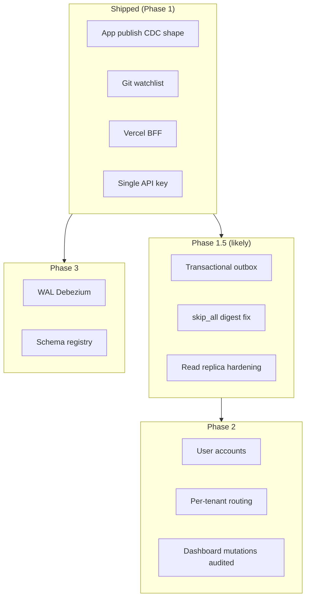

# Part 11 — Roadmap & evolution

[← Part 10](./10-ci-cd-and-release-train.md) · [Series index](./README.md)

## Decision summary

Roadmap is **semver-themed minors** on a **three-phase product arc**. Architectural bets (application CDC, Git watchlist, Vercel BFF) are **strangler patterns** toward SaaS and WAL CDC — not dead ends.

---

## Release train (engineering ↔ product)

| Version | Theme | Architectural deliverables |
|---------|--------|---------------------------|
| **v0.5.x** | Reader notifications | `notification_prefs`, batcher, filters, `scan_group` |
| **v0.6.0** | Sources & resilience | `fallback_sources`, hiatus/stale, schedule hints |
| **v0.7.0** | Operator sanity | Watchlist linter CI, dashboard ops matrix, fast-retry |
| **v0.8.0** | Discord community | Bot commands, roles — **new ingress path** |
| **v0.9.0** | Homelab archive | CBZ, OPDS, RSS — **scraper `FetchPages` pays off** |
| **v1.0.0** | Phase 1 complete | Docs, hardened pipeline, self-host story |
| **v2.0.0** | SaaS | Multi-tenant schema, auth, RLS |
| **v3.0.0** | True CDC + ecosystem | Debezium, Avro registry |

Patch releases fix within theme without new ADRs unless invariants change.

---

## Architectural evolution map



---

## True WAL CDC migration (PE playbook)

### Current

```
Scraper: INSERT → publish JSON
Notifier: consume JSON
```

### Target

```
Postgres WAL → Debezium Connect → Kafka → Notifier (unchanged consumer)
```

| Work stream | Effort |
|-------------|--------|
| Notifier consumer | **Low** — envelope unchanged |
| Scraper | **Medium** — remove publish; optional heartbeat |
| Infra | **High** — Connect cluster, replication slot, monitoring |
| Serverless fit | **Poor** — Connect not on Cloud Run Job |

**Recommendation:** Pilot on **VM target** with logical replication enabled on provider; keep serverless on app-publish until slot ops proven.

---

## Phase 2 SaaS (what breaks if rushed)

Adding `users` without ADR risks:

| Mistake | Consequence |
|---------|-------------|
| Shared API key forever | No per-user revoke |
| Notifier reads global prefs only | Cannot personalize |
| Public proxy for all data | GDPR-style exposure |
| Single `notification_log` | No per-tenant audit |

**Required before v2.0:**

- Row-level security or tenant_id on all tables
- Auth on dashboard (session/OAuth)
- Secret rotation per tenant for webhooks (or platform-owned delivery)

---

## Feature backlog → architecture touchpoints

| Feature | Touches |
|---------|---------|
| FlareSolverr / proxy | Scraper adapter HTTP client |
| In-app series editor | Notifier admin API + dashboard + security ADR |
| Multi-user Discord `/subscribe` | New bot service or notifier module |
| CBZ archiver | Scraper `FetchPages`, storage, quotas |
| Encrypted webhook URLs | Postgres `pgcrypto`, key management |
| Watchlist linter | CI only (v0.7) — no runtime change |
| `fallback_sources` | Diff engine + watchlist schema |

---

## Master alternatives index

Decisions a PE can challenge in one table:

| Domain | Chosen | Credible alternative | Why chosen |
|--------|--------|----------------------|------------|
| Languages | Go + Java | Single stack | Best tool per workload |
| Watchlist | Git PR | Dashboard CRUD | Audit, community, no admin API |
| Events | App publish | Debezium day 1 | RAM/ops on small VM |
| Bus | Kafka and/or QStash | SNS/SQS only | Operator BYO already on Kafka |
| Dashboard auth | Vercel proxy + API key | OAuth | Phase 1 single operator |
| Public health | GHA → KV | Browser → notifier | Secret + abuse |
| Prod deploy | Git tag | Continuous | Blast radius |
| Schema | Postgres | SQLite | Replication + concurrency |
| Reads | Optional replica | Primary only | Neon pooler free tier |
| Scrape schedule | 2h Job | 15m | Cost |
| Notifier host | Cloud Run | K8s pod | Scale-to-zero |
| IaC | Terraform 4-cloud | Pulumi/CDK | Portability portfolio |
| CI orchestration | pipeline-compose | One YAML | Stage reuse |
| Idempotency | `is_new` + DB URL check | Exactly-once bus | At-least-once reality |

---

## How to extend this series

When making a durable architectural decision:

1. Add **Decision summary** + **Invariants** to relevant part (or new Part 12).
2. Update **alternatives index** in this doc.
3. Link from PR description for design review.
4. Keep [security-model.md](../security-model.md) as checklist only — rationale stays here.

---

## Series index

| Part | Topic |
|------|--------|
| [01](./01-problem-and-goals.md) | Charter |
| [02](./02-system-architecture.md) | Boundaries |
| [03](./03-scraper-and-source-adapters.md) | Ingestion |
| [04](./04-database-and-eventing.md) | Durability |
| [05](./05-notification-service.md) | Policy |
| [06](./06-operator-surfaces.md) | Edge |
| [07](./07-security-rationale.md) | Trust |
| [08](./08-deployment-topology.md) | Infra |
| [09](./09-observability-and-cost.md) | Ops economics |
| [10](./10-ci-cd-and-release-train.md) | Change safety |
| **11** | Evolution (this doc) |
